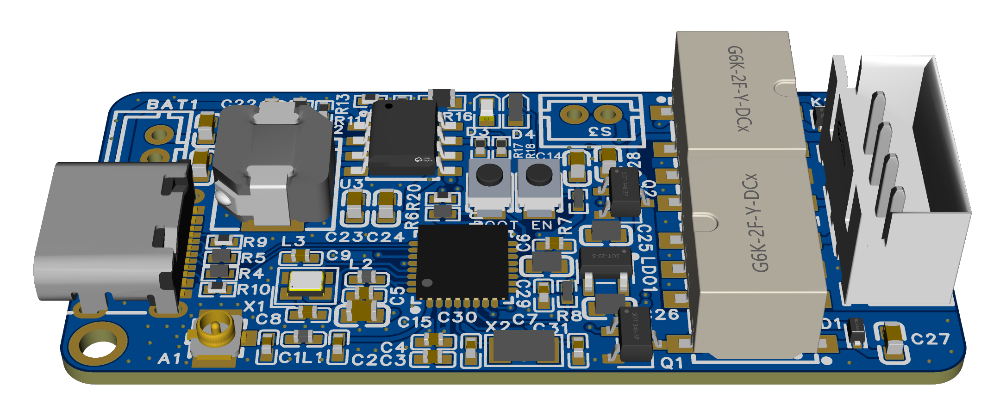

# openrz67-trigger

openrz67-trigger is an arduino compatible project made for enabling remote triggering of the Mamiya RZ67 analog camera from an app. openrz67-trigger is made to run on a small ESP32 device (in this case Seeed XIAO ESP32C3) that is connected to the electrical input pins on the Mamiya RZ67 camera.

There is also an android app made for communication with openrz67-trigger, see [openrz67-android](https://github.com/mhellevang/openrz67-android).

## Hardware
Openrz67-trigger is made to run on an ESP32-C3, a single-core Wi-Fi and Bluetooth 5 (LE) microcontroller SoC from Espressif.

My current prototype is made up of:

* 1x Custom ESP32C3 board
* 2x G6K-2F-Y-DC3 relays to control the shutter release
* All the other bibs and bobs required to run a ESP32C3
* A small 500mah LiPo for power
* SS12F15 power switch
* 3d printed case with toggle embedded

However, the solution is flexible and can be used with a standard ESP32-C3 development board if you do not want to go down the path of a custom PCB.

## Camera connection

The camera has a four pin IO port in front. The pins are labeled as follows (left to right):

* 1: 6v. Can be ignored, we don't need it for this project.
* 2: GND (Ground)
* 3: S1 switch
* 4: S2 switch

To trigger the shutter release from the ESP32, we need to short S1/S2 to GND.

