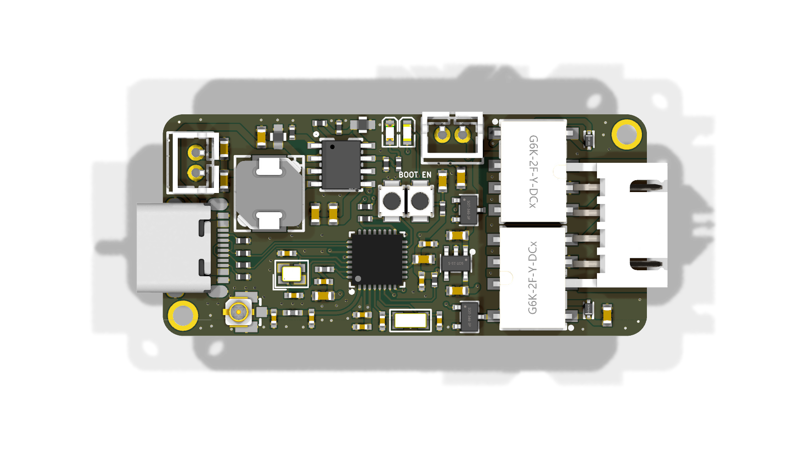
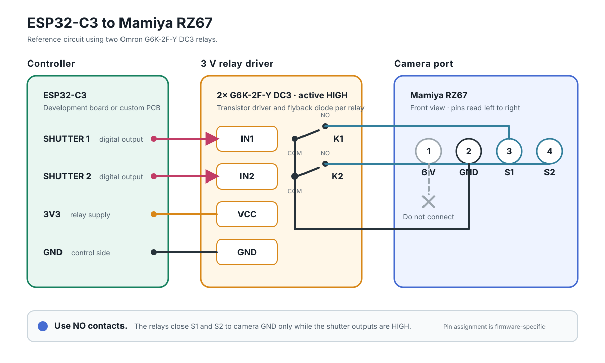

# openrz67-trigger

ESP32 firmware for remote-triggering the Mamiya RZ67 analog camera over Bluetooth LE. It runs on an ESP32-C3 connected to the camera's electrical remote port and is controlled from the companion Android app, [openrz67-android](https://github.com/mhellevang/openrz67-android).

## Features

* Instant shutter release
* Bulb mode for remote long exposures
* Self-timer countdown with app-configurable duration
* Power-optimized: 80 MHz CPU with light sleep and 0 dBm BLE TX power, running off a small LiPo

## Hardware

The current prototype is a custom PCB (design and fabrication files in [`pcb/`](pcb/)):



The PCB source is the KiCad project in [`pcb/kicad/`](pcb/kicad/) (ported from EasyEDA Pro in September 2026). Generated Gerber/BOM/position files are in `pcb/kicad/out/`. The fabricated 2025-09-23 revision and the EasyEDA Pro exports are kept under [`pcb/archive/`](pcb/archive/).

* 1× ESP32-C3FH4
* 2× Omron G6K-2F-Y DC3 relays to control the shutter release
* Supporting components per the [BOM](pcb/kicad/out/openrz67-bom.csv)
* 2.4 GHz antenna with U.FL connector
* 250 mAh LiPo for power
* SS12F15 slide switch

The solution is flexible: an ESP32-C3 development board such as the Seeed XIAO ESP32C3 and two relay channels work too. Assign two output-capable GPIOs in `src/main.cpp`. The reference circuit uses two Omron G6K-2F-Y DC3 relays with active-high transistor drivers and flyback diodes. Other relays or modules may require a different supply voltage or inverted output logic.



### Current PCB pinout

| GPIO | Function |
|------|----------|
| 3    | Shutter relay 1 |
| 21   | Shutter relay 2 |
| 20   | Status LED |

### Camera connector

The custom PCB uses a JST B4B-XH-A four-pin header (`U4`):

| U4 pin | Camera signal |
|--------|---------------|
| 1      | Not connected (camera 6 V) |
| 2      | GND |
| 3      | S1 |
| 4      | S2 |

Verify the pin 1 orientation before assembling the camera cable.

## Camera connection

Viewed from the front, the camera's four-pin remote-control port is:

1. 6 V — do not connect
2. GND
3. S1 switch
4. S2 switch

To trigger the shutter release, the relays short S1/S2 to GND. For bulb exposures, set the camera's shutter-speed dial to `B`. The camera closes the shutter automatically after approximately 60 seconds even if the switches remain closed.

## BLE protocol

The device advertises as `OpenRZ67` with service UUID `c9239c9e-6fc9-4168-b3aa-53105eb990b0` and characteristic `458d4dc9-349f-401d-b092-a2b1c55f5319`. Send commands using Write Without Response.

**Single-byte commands** (value = button × 10 + state):

| Value | Action |
|-------|--------|
| 11 | Trigger shutter with a 100 ms pulse |
| 10 | Clear status LED; no shutter action |
| 21 | Start bulb mode |
| 20 | End bulb mode |
| 31 | Start countdown with the default duration of 10 s |
| 30 | Cancel countdown |

**Three-byte commands** `[command, duration, action]`:

| Bytes | Action |
|-------|--------|
| `[3, n, 1]` | Start countdown of *n* seconds (`1–255`) |
| `[3, _, 0]` | Cancel countdown |

Starting a trigger or bulb exposure cancels any pending countdown.

## Building

The project uses [PlatformIO](https://platformio.org/) and the `esp32-c3-devkitm-1` board definition:

```bash
pio run
pio run -t upload
```

If uploading does not start, hold `BOOT`, press and release `EN`, then release `BOOT` and retry.

Serial logging is disabled because UART0 uses GPIO 20 and GPIO 21, which are assigned to the status LED and a relay.

## License

[MIT](LICENSE)
