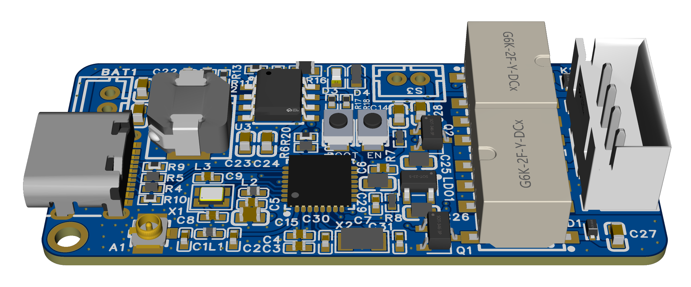

# openrz67-trigger

ESP32 firmware for remote-triggering the Mamiya RZ67 analog camera over Bluetooth LE. It runs on an ESP32-C3 connected to the camera's electrical remote port and is controlled from the companion Android app, [openrz67-android](https://github.com/mhellevang/openrz67-android).

## Features

* Instant shutter release
* Bulb mode — hold the shutter open for long exposures
* Self-timer countdown with app-configurable duration
* Power-optimized: 80 MHz CPU with light sleep and 0 dBm BLE TX power, running off a small LiPo

## Hardware

The current prototype is a custom PCB (fabrication files in [`pcb/`](pcb/)):



* 1× ESP32-C3FH4
* 2× G6K-2F-Y-DC3 relays to control the shutter release
* Supporting components per the [BOM](pcb/BOM_ESP32CamTrigger_1_ESP32CamTrigger_PCB_2_2025-09-23.csv)
* 250 mAh LiPo for power
* SS12F15 slide switch

The solution is flexible: an ESP32-C3 development board such as the Seeed XIAO ESP32C3 and two relay channels work too. Assign two output-capable GPIOs in `src/main.cpp`. The reference circuit uses two Omron G6K-2F-Y DC3 relays with active-high transistor drivers and flyback diodes. Other relays or modules may require a different supply voltage or inverted output logic.


### Current PCB pinout

| GPIO | Function |
|------|----------|
| 3    | Shutter relay 1 |
| 21   | Shutter relay 2 |
| 20   | Status LED |

## Camera connection

The camera has a four-pin IO port in front, labeled left to right:

1. 6 V — not needed for this project
2. GND
3. S1 switch
4. S2 switch

To trigger the shutter release, the relays short S1/S2 to GND.

## BLE protocol

The device advertises as `OpenRZ67` with service UUID `c9239c9e-6fc9-4168-b3aa-53105eb990b0` and a writable characteristic `458d4dc9-349f-401d-b092-a2b1c55f5319`.

**Single-byte commands** (value = button × 10 + state):

| Value | Action |
|-------|--------|
| 11 / 10 | Trigger shutter / release |
| 21 / 20 | Start / end bulb mode |
| 31 / 30 | Start countdown (default 10 s) / cancel |

**Three-byte commands** `[command, duration, action]`:

| Bytes | Action |
|-------|--------|
| `[3, n, 1]` | Start countdown of *n* seconds |
| `[3, _, 0]` | Cancel countdown |

Starting a trigger or bulb exposure cancels any pending countdown.

## Building

The project uses [PlatformIO](https://platformio.org/):

```bash
pio run -t upload
```

Serial output is disabled by default to save power; set `VERBOSE` to `1` in `src/main.cpp` to enable it.
